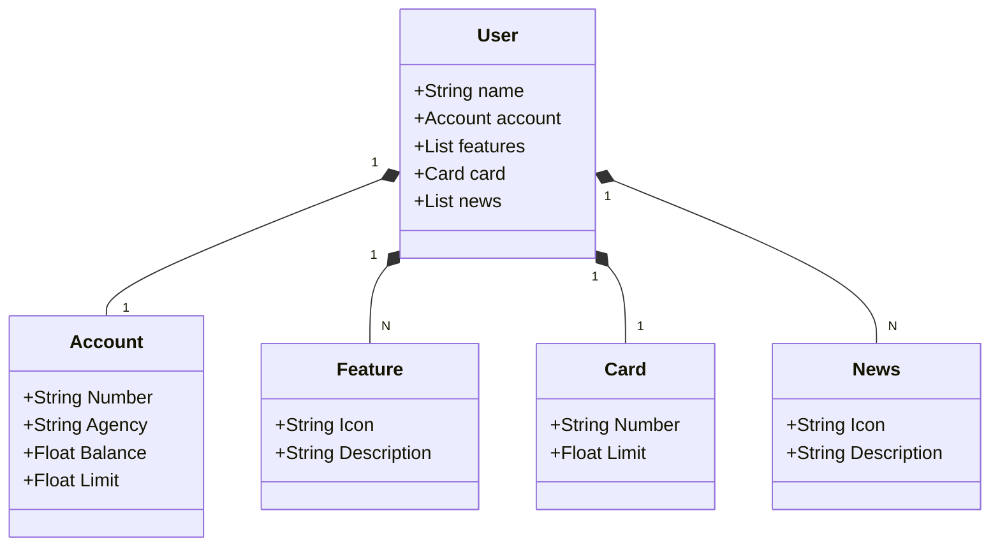

# Desafio DIO API REST
Java RESTful API criada para um Banco.

## Diagrama de Classes

```mermaid 
classDiagram
    class User {
        +String name
        +Account account
        +List<Feature> features
        +Card card
        +List<News> news
    }

    class Account {
        +String Number
        +String Agency
        +Float Balance
        +Float Limit
    }

    class Feature {
        +String Icon
        +String Description
    }

    class Card {
        +String Number
        +Float Limit
    }

    class News {
        +String Icon
        +String Description
    }

    User "1" *--  "1" Account
    User "1" *--  "N" Feature
    User "1" *--  "1" Card
    User "1" *--  "N" News

```
